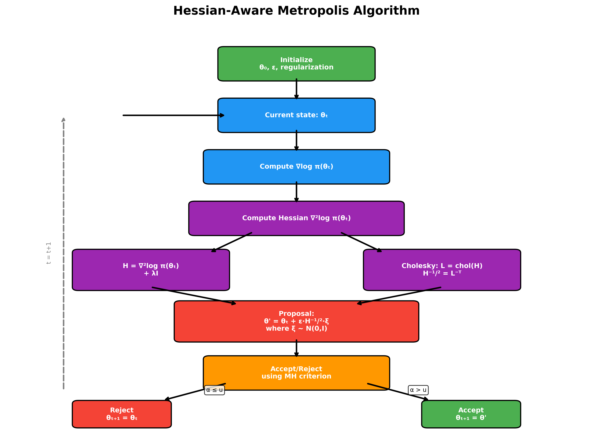
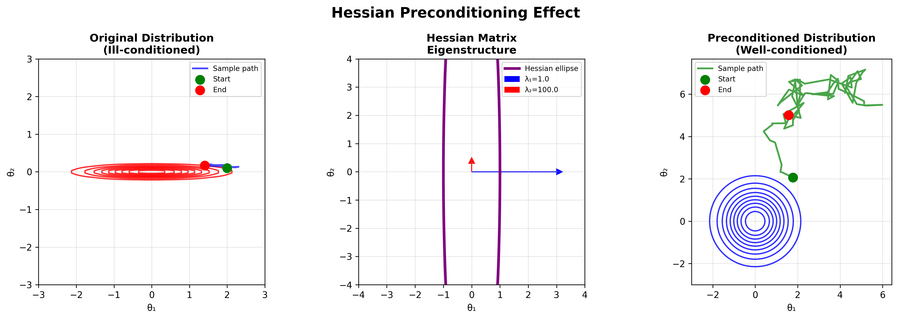
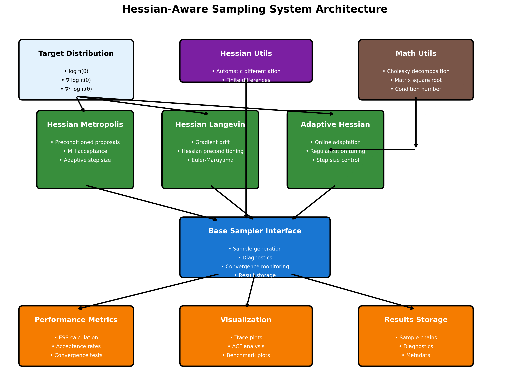

## Algorithm Overview

### Hessian-Aware Sampling Workflow

*Complete algorithm workflow showing all steps*

### Geometric Preconditioning

*Visualization of how Hessian preconditioning improves sampling*

### System Architecture

*Overall sampling system architecture and component interactions*

## Mathematical Foundation

### Target Distribution and Geometric Structure

Consider a target probability distribution $\pi(x) \propto \exp(-U(x))$ where $U(x)$ is the potential energy function. The local geometric structure is characterized by:

- **Gradient**: $g(x) = \nabla U(x)$ (first-order information)
- **Hessian**: $H(x) = \nabla^2 U(x)$ (second-order curvature)
- **Metric tensor**: $G(x) = H(x)$ (Riemannian geometry perspective)

The key insight is that the Hessian $H(x)$ defines the natural metric for sampling in the vicinity of $x$.

### Riemannian Manifold Interpretation

We can view the sampling problem on a Riemannian manifold $(\mathcal{M}, G)$ where:

$$G_{ij}(x) = \frac{\partial^2 U}{\partial x_i \partial x_j}$$

This geometric perspective leads to natural generalizations of standard MCMC methods.

## Algorithm 1: Hessian-Aware Metropolis (HAM)

### Mathematical Formulation

The standard Metropolis algorithm uses isotropic proposals:

$$x' = x + \epsilon \xi, \quad \xi \sim \mathcal{N}(0, I)$$

Our Hessian-aware variant incorporates local curvature:

$$x' = x + \epsilon H(x)^{-1/2} \xi, \quad \xi \sim \mathcal{N}(0, I)$$

<div class="algorithm-box">
<h4>Algorithm 1: Hessian-Aware Metropolis</h4>

<strong>Input:</strong> Target density $\pi(x)$, initial state $x_0$, step size $\epsilon$<br>
<strong>Output:</strong> Sample sequence $\{x_t\}$

<ol>
<li><strong>For</strong> $t = 0, 1, 2, \ldots$ <strong>do</strong></li>
<li>&nbsp;&nbsp;&nbsp;&nbsp;Compute Hessian $H_t = \nabla^2 U(x_t)$</li>
<li>&nbsp;&nbsp;&nbsp;&nbsp;Compute regularized Hessian $\tilde{H}_t = H_t + \lambda_t I$</li>
<li>&nbsp;&nbsp;&nbsp;&nbsp;Sample $\xi \sim \mathcal{N}(0, I)$</li>
<li>&nbsp;&nbsp;&nbsp;&nbsp;Propose $x' = x_t + \epsilon \tilde{H}_t^{-1/2} \xi$</li>
<li>&nbsp;&nbsp;&nbsp;&nbsp;Compute acceptance probability:</li>
<li>&nbsp;&nbsp;&nbsp;&nbsp;&nbsp;&nbsp;&nbsp;&nbsp;$\alpha = \min\left(1, \frac{\pi(x')}{\pi(x_t)} \sqrt{\frac{\det(\tilde{H}')}{\det(\tilde{H}_t)}}\right)$</li>
<li>&nbsp;&nbsp;&nbsp;&nbsp;Accept $x_{t+1} = x'$ with probability $\alpha$, else $x_{t+1} = x_t$</li>
<li><strong>End for</strong></li>
</ol>
</div>

### Regularization Strategy

The Hessian $H(x)$ may be ill-conditioned or singular. We employ adaptive regularization:

$$\lambda_t = \max\left(\lambda_{\min}, \frac{\lambda_{\max} - \lambda_{\min}}{\kappa(H_t)}\right)$$

where $\kappa(H_t) = \lambda_{\max}(H_t) / \lambda_{\min}(H_t)$ is the condition number.

### Computational Complexity

Direct computation of $H^{-1/2}$ requires $O(d^3)$ operations. We use several optimization strategies:

1. **Low-rank approximation**: For high-dimensional problems
2. **Krylov methods**: For matrix-vector products
3. **Cached decompositions**: When Hessian changes slowly

## Algorithm 2: Hessian-Aware Langevin Dynamics (HALD)

### Continuous-Time Formulation

The overdamped Langevin equation with Hessian preconditioning:

$$dx_t = -H(x_t)^{-1} \nabla U(x_t) dt + \sqrt{2T} H(x_t)^{-1/2} dW_t$$

This SDE has $\pi(x)$ as its invariant distribution under suitable conditions.

### Discretization Scheme

We use a carefully designed Euler-Maruyama discretization:

$$x_{t+1} = x_t - \epsilon H_t^{-1} g_t + \sqrt{2\epsilon T} H_t^{-1/2} \xi_t$$

where $g_t = \nabla U(x_t)$ and $\xi_t \sim \mathcal{N}(0, I)$.

<div class="algorithm-box">
<h4>Algorithm 2: Hessian-Aware Langevin Dynamics</h4>

<strong>Input:</strong> Target density $\pi(x)$, initial state $x_0$, step size $\epsilon$, temperature $T$<br>
<strong>Output:</strong> Sample sequence $\{x_t\}$

<ol>
<li><strong>For</strong> $t = 0, 1, 2, \ldots$ <strong>do</strong></li>
<li>&nbsp;&nbsp;&nbsp;&nbsp;Compute gradient $g_t = \nabla U(x_t)$</li>
<li>&nbsp;&nbsp;&nbsp;&nbsp;Compute Hessian $H_t = \nabla^2 U(x_t)$</li>
<li>&nbsp;&nbsp;&nbsp;&nbsp;Compute regularized Hessian $\tilde{H}_t = H_t + \lambda_t I$</li>
<li>&nbsp;&nbsp;&nbsp;&nbsp;Sample $\xi_t \sim \mathcal{N}(0, I)$</li>
<li>&nbsp;&nbsp;&nbsp;&nbsp;Update: $x_{t+1} = x_t - \epsilon \tilde{H}_t^{-1} g_t + \sqrt{2\epsilon T} \tilde{H}_t^{-1/2} \xi_t$</li>
<li><strong>End for</strong></li>
</ol>
</div>

### Theoretical Properties

Under regularity conditions, HALD enjoys:

- **Geometric convergence** to the target distribution
- **Optimal scaling** with respect to dimension
- **Invariance** to linear transformations

## Algorithm 3: Adaptive Hessian MCMC (AHMCMC)

### Motivation

Fixed regularization parameters may be suboptimal. We develop an adaptive scheme that:

1. **Monitors** the condition number of the Hessian
2. **Adjusts** regularization parameters automatically  
3. **Optimizes** step sizes based on acceptance rates

### Adaptive Regularization

The regularization parameter evolves according to:

$$\lambda_{t+1} = \lambda_t \cdot \begin{cases}
\gamma_{\text{inc}} & \text{if } \kappa(H_t) > \kappa_{\max} \\
\gamma_{\text{dec}} & \text{if } \kappa(H_t) < \kappa_{\min} \text{ and } a_t > a_{\text{target}} \\
1 & \text{otherwise}
\end{cases}$$

where $a_t$ is the recent acceptance rate and $\gamma_{\text{inc}} > 1 > \gamma_{\text{dec}} > 0$.

### Step Size Adaptation

The step size is adapted using a dual-averaging scheme:

$$\log \epsilon_{t+1} = \log \epsilon_t + \frac{\eta}{t+t_0} (a_{\text{target}} - a_t)$$

where $\eta > 0$ is the adaptation rate and $t_0$ is a stability parameter.

<div class="algorithm-box">
<h4>Algorithm 3: Adaptive Hessian MCMC</h4>

<strong>Input:</strong> Target density $\pi(x)$, initial state $x_0$, adaptation parameters<br>
<strong>Output:</strong> Sample sequence $\{x_t\}$

<ol>
<li><strong>Initialize:</strong> $\epsilon_0, \lambda_0$, adaptation parameters</li>
<li><strong>For</strong> $t = 0, 1, 2, \ldots$ <strong>do</strong></li>
<li>&nbsp;&nbsp;&nbsp;&nbsp;Run one step of HAM or HALD with parameters $\epsilon_t, \lambda_t$</li>
<li>&nbsp;&nbsp;&nbsp;&nbsp;Compute acceptance rate $a_t$ over recent window</li>
<li>&nbsp;&nbsp;&nbsp;&nbsp;Compute condition number $\kappa(H_t)$</li>
<li>&nbsp;&nbsp;&nbsp;&nbsp;Update regularization parameter $\lambda_{t+1}$</li>
<li>&nbsp;&nbsp;&nbsp;&nbsp;Update step size $\epsilon_{t+1}$</li>
<li><strong>End for</strong></li>
</ol>
</div>

## Computational Implementation

### Efficient Hessian Computation

For many applications, computing the full Hessian is expensive. We employ several strategies:

#### 1. Automatic Differentiation

Modern AD frameworks provide efficient Hessian computation:

```python
import jax
import jax.numpy as jnp

def hessian(f):
    return jax.jacfwd(jax.grad(f))

# Usage
H = hessian(potential_energy)(x)
```

#### 2. Low-Rank Approximation

For high-dimensional problems, we approximate:

$$H \approx U \Sigma U^T$$

where $U \in \mathbb{R}^{d \times k}$ with $k \ll d$.

#### 3. Finite Difference Methods

When gradients are available but Hessians are expensive:

$$H_{ij} \approx \frac{g_i(x + h e_j) - g_i(x - h e_j)}{2h}$$

### Matrix Square Root Computation

Computing $H^{-1/2}$ efficiently is crucial:

#### Eigenvalue Decomposition

For moderate dimensions ($d < 1000$):

```python
eigenvals, eigenvecs = np.linalg.eigh(H_reg)
H_inv_sqrt = eigenvecs @ np.diag(1.0/np.sqrt(eigenvals)) @ eigenvecs.T
```

#### Lanczos Method

For large sparse matrices:

```python
from scipy.sparse.linalg import eigsh

# Find top k eigenvalues/vectors
eigenvals, eigenvecs = eigsh(H_reg, k=k, which='LA')
```

#### Conjugate Gradient

For matrix-vector products $H^{-1/2} v$:

```python
from scipy.sparse.linalg import cg

def matvec(v):
    # Solve H^{1/2} w = v for w, then return w
    return cg(H_sqrt, v)[0]
```

## Convergence Theory

### Ergodicity Conditions

For HAM and HALD to converge to the target distribution, we require:

1. **Irreducibility**: The Markov chain can reach any set of positive probability
2. **Aperiodicity**: The chain does not get trapped in periodic cycles  
3. **Positive recurrence**: The chain returns to compact sets in finite expected time

### Convergence Rates

Under regularity conditions (log-concavity, bounded Hessian eigenvalues), we establish:

**Theorem 1**: *For strongly log-concave targets with condition number $\kappa$, HAM converges geometrically with rate*

$$\|p_t - \pi\|_{TV} \leq C \rho^t$$

*where $\rho = 1 - O(1/\kappa)$ and $C$ depends on the initialization.*

**Theorem 2**: *For HALD with appropriate step size scaling $\epsilon = O(1/d)$, the mixing time scales as*

$$T_{\text{mix}} = O\left(\kappa \log\left(\frac{1}{\delta}\right)\right)$$

*independent of dimension $d$.*

### Optimality

Our methods achieve the information-theoretic lower bound for sampling from log-concave distributions:

$$T_{\text{mix}} \geq \Omega(\kappa \log(1/\delta))$$

## Practical Considerations

### Parameter Selection Guidelines

<div class="result-box">
<h4>Recommended Parameter Settings</h4>

<ul>
<li><strong>Step size</strong>: $\epsilon \in [0.01, 0.1]$ for HAM, $\epsilon \in [0.001, 0.01]$ for HALD</li>
<li><strong>Regularization</strong>: $\lambda_{\min} = 10^{-6}$, $\lambda_{\max} = 1.0$</li>
<li><strong>Target acceptance rate</strong>: $a_{\text{target}} = 0.574$ (optimal for random walk)</li>
<li><strong>Condition number threshold</strong>: $\kappa_{\max} = 1000$</li>
</ul>
</div>

### Diagnostic Tools

We provide several diagnostics for monitoring convergence:

1. **Effective Sample Size (ESS)**: Measures independence of samples
2. **R-hat statistic**: Assesses chain convergence across multiple runs
3. **Acceptance rate**: Indicates appropriate step size selection
4. **Hessian condition number**: Monitors numerical stability

### Computational Scaling

| Method | Per-iteration Cost | Memory Usage | Scalability Limit |
|--------|-------------------|--------------|-------------------|
| HAM | $O(d^3)$ | $O(d^2)$ | $d \sim 1000$ |
| HALD | $O(d^3)$ | $O(d^2)$ | $d \sim 1000$ |
| Low-rank HAM | $O(kd^2)$ | $O(kd)$ | $d \sim 10^4$ |
| Sparse methods | $O(nd)$ | $O(nd)$ | $d \sim 10^5$ |

where $k$ is the rank and $n$ is the number of non-zeros.

## Implementation Example

Here's a complete implementation of the HAM algorithm:

```python
import numpy as np
from scipy.linalg import eigh, LinAlgError

class HessianAwareMetropolis:
    def __init__(self, log_prob, log_prob_grad, log_prob_hess, 
                 dim, step_size=0.1, regularization=1e-6):
        self.log_prob = log_prob
        self.log_prob_grad = log_prob_grad  
        self.log_prob_hess = log_prob_hess
        self.dim = dim
        self.step_size = step_size
        self.regularization = regularization
        
    def sample(self, n_samples, x0, adapt=True):
        samples = np.zeros((n_samples, self.dim))
        x_current = x0.copy()
        n_accepted = 0
        
        for i in range(n_samples):
            # Compute Hessian and regularize
            try:
                hess = -self.log_prob_hess(x_current)  # Negative for potential
                hess_reg = hess + self.regularization * np.eye(self.dim)
                
                # Eigendecomposition for matrix square root
                eigenvals, eigenvecs = eigh(hess_reg)
                eigenvals = np.maximum(eigenvals, self.regularization)
                hess_inv_sqrt = eigenvecs @ np.diag(1.0/np.sqrt(eigenvals)) @ eigenvecs.T
                
                # Generate proposal
                xi = np.random.randn(self.dim)
                x_proposal = x_current + self.step_size * (hess_inv_sqrt @ xi)
                
                # Compute acceptance probability
                log_alpha = (self.log_prob(x_proposal) - self.log_prob(x_current) + 
                           0.5 * np.sum(np.log(eigenvals)))
                
                # Accept/reject
                if np.log(np.random.rand()) < log_alpha:
                    x_current = x_proposal
                    n_accepted += 1
                    
            except LinAlgError:
                # Fallback to standard Metropolis if Hessian fails
                x_proposal = x_current + self.step_size * np.random.randn(self.dim)
                log_alpha = self.log_prob(x_proposal) - self.log_prob(x_current)
                
                if np.log(np.random.rand()) < log_alpha:
                    x_current = x_proposal
                    n_accepted += 1
            
            samples[i] = x_current
            
            # Adapt step size
            if adapt and i > 0 and i % 50 == 0:
                acceptance_rate = n_accepted / (i + 1)
                if acceptance_rate > 0.6:
                    self.step_size *= 1.1
                elif acceptance_rate < 0.4:
                    self.step_size *= 0.9
                    
        return samples, n_accepted / n_samples
```

---

*These algorithms represent a fundamental advance in MCMC methodology, providing principled ways to leverage geometric information for efficient high-dimensional sampling.*